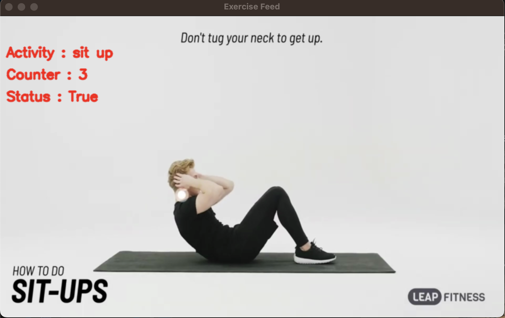

# WORKOBOT - Your AI Fitness Companion 🤖💪

**WORKOBOT** is a comprehensive, AI-powered desktop fitness application designed to be your all-in-one personal trainer. It combines a real-time exercise tracker using your webcam with personalized diet recommendations and a calorie counter to help you achieve your fitness goals.

## ✨ Features

* **AI Gym Trainer**: Utilizes your webcam and MediaPipe's pose estimation to count your reps for various exercises in real-time.
* **Personalized Diet Recommender**: Generates custom meal plans based on your physical stats (weight, height, age), activity level, and fitness goals (weight loss, maintenance, or weight gain).
* **Calorie Tracker**: A detailed tool to log your meals and monitor your daily caloric and nutritional intake from an extensive food database.
* **User Authentication**: Secure login and signup system to store and manage your personal data and progress.
* **Offline Mode**: The application remains functional even without a database connection, with core features like the home page, calorie tracker, and session-based exercise counter available.
* **User Profile**: A dedicated section to view your saved physical stats and fitness goals.

## 📸 Screenshots

### Diet & Calorie Management

<table>
  <tr>
    <td align="center"><strong>Diet Recommender</strong></td>
    <td align="center"><strong>Calorie Tracker</strong></td>
  </tr>
  <tr>
    <td></td>
    <td></td>
  </tr>
</table>

### Real-Time Exercise Tracking

<table>
  <tr>
    <td align="center"><strong>Push-Up Counter</strong></td>
    <td align="center"><strong>Pull-Up Counter</strong></td>
  </tr>
  <tr>
    <td></td>
    <td></td>
  </tr>
  <tr>
    <td align="center"><strong>Squat Counter</strong></td>
    <td align="center"><strong>Sit-Up Counter</strong></td>
  </tr>
  <tr>
    <td></td>
    <td></td>
  </tr>
</table>

## 🛠️ Tech Stack

* **Frontend**: Python with `Tkinter` and `customtkinter` for the graphical user interface.
* **AI/Machine Learning**: `OpenCV` for video capture and `Google MediaPipe` for real-time pose estimation and landmark detection.
* **Database**: `MySQL` for user data storage and management.
* **Data Handling**: `Pandas` for managing and processing food and nutrient data from CSV files.
* **Libraries**: `Pillow (PIL)` for image processing, `mysql-connector-python`.

## 🚀 Setup and Installation

Follow these steps to get WORKOBOT running on your local machine.

### 1. Prerequisites

* Python 3.9+
* A running MySQL server instance.
* A webcam connected to your computer.

### 2. AI Gym Trainer: Pose Estimation Logic

The core of the AI Gym Trainer is its ability to understand and count exercises. This is achieved by analyzing the angles between key body joints (like elbows, hips, and knees) detected by MediaPipe.

For each exercise, the application monitors the angle of specific joints. A repetition is counted when the angle passes certain thresholds, corresponding to the "up" and "down" phases of the movement. For example, a squat is counted when the knee angle goes from >160° (standing) to <90° (squatting) and back.

The angle between three points (e.g., shoulder, elbow, wrist) is calculated using the vector dot product formula shown below:

$$
\theta = \arccos\left(\frac{\vec{BA} \cdot \vec{BC}}{\|\vec{BA}\| \|\vec{BC}\|}\right)
$$


### 3. Clone the Repository

```bash
git clone [https://github.com/yashparalkar/WORKOBOT.git](https://github.com/yashparalkar/WORKOBOT.git)
cd WORKOBOT